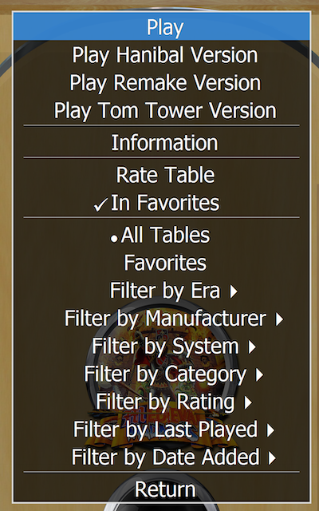

# Two Tables, One Wheel 
Alternate versions of a table under one wheel item in [PinballY](http://mjrnet.org/pinscape/PinballY.php).



Loosely based on [Custom Play Modes](http://mjrnet.org/pinscape/downloads/PinballY/Help/CustomPlayModesExample.html) from mjr at. *And a shout out for mjr's excellent documentation. It is among the best documentation I have ever seen for an open-source project.*

There are a few tables that have multiple versions and I did not want to install only one, but I also did not want multiple wheel items, all with the same picture. I really wanted something similar to a [Pinup Popper example](https://www.nailbuster.com/wikipinup/doku.php?id=alt_mode) where one wheel item launches alternate versions of a table. In their example the table is copied into place (yuck). MJR's example for [Custom Play Modes](http://mjrnet.org/pinscape/downloads/PinballY/Help/CustomPlayModesExample.html) was close, but really only allowed sending different parameters to the same table. I wanted to launch an entirely different table. The way this works is to add to the Play section in the main menu with additional `Play ___ Version` items. One for each alternate version that you identify. Using this code, you could have (using Medieval Madness as an example):

```
     Play
     Play Hanibal Version
     Play Remake Version
     Play Tom Tower Version
     Play Pinball FX3 Version
```

The simple `Play` item chooses you base or non-alternate version table. You must have one that is the default. Also, this is the one that will be launched if you hit the single-action play button on your cabinet. 

## Installing

*This has not been extensively tested (2021/02/22) on any systems but my own.*

Drop the `two-tables-one-wheel.js` into your `PinballY\Scripts` directory and add the following to your `PinballY\Scripts\main.js` to enable:

```
// Alternate tables under one wheel icon
import "two-tables-one-wheel.js"; 
```

Once you have done that, restart PinballY and you should be ready to start setting up your tables and their alternates.

## Default Table Setup

You have to set up your tables first. Choose one, your favorite as the *default* version. This is likely the one you play most often and what most of your guests will play. Set this up as usual in PinballY. There is nothing special to do for this table other than making sure it is setup and working.

## Alternate Version Tables Setup

Set up your alternate tables just like any other table in PinballY. Add all the same details, table videos, wheel logo, etc. as any other (and your default) table. They can be the same or different from the default table at your choosing. You will see these tables media items when you launch the table so it is nice to have them set. Also, you will be able to see these tables when `Show Alternate Versions` is selected in the `Operator Menu` (see below).

To make this script work properly, your alternate tables **must have the same base name as your default table** in PinballY, followed by the version name in parenthesis and then the (manufacturer year) label. This is *not* the file name, but PinballY's name/title/description of the table. If you poke at the XML it's the `<description>` element. The text must match up to the second to last item in parenthesis.

For example with AC/DC's LUCI table, you could have two versions; the standard version, and the *adult* version. The first item is the default and the adult version is the alternate version that can be chosen from the Play menu. Note the `(Adult)`. This is what will get used to display on the Play menu as `Play Adult Version`. It's the second to last parenthetical.

```
     AC-DC (LUCI Premium) (Williams 1997)
     AC-DC (LUCI Premium) (Adult) (Williams 1997)
```

In the earlier Medieval Madness example, my tables look like this:

```
	Medieval Madness (Williams 1997)
	Medieval Madness (Hanibal) (Williams 1997)
	Medieval Madness (Remake) (Chicago Gaming Company 2015)
	Medieval Madness (Tom Tower) (Williams 1997)
	Medieval Madness (Williams 1997)
```

Note that last one. The name is identical to the default first one. There's a little trick in the code that if the name is the same, then it will include the system as the version. In this case, that last table is my Pinball FX3 version. This also means your alternate versions can cross systems. The remainder of these tables are Visual Pinball X.

For each of your alternate tables you also need to assign them the category `isAlternateVersion`. You should do this using the PinballY user interface, under edit game, select categories. These are the normal PinballY categories. The category (or tag) serves two purposes:

1. There is a *metafilter* added that hides/shows alternate version tables from the main menu. This can be enabled/disabled in the Operator Menu. If `Show Alternate Versions` is on, then all tables, including the alternate versions will appear on the wheel (use this mode to configure the alternate versions). If `Show Alternate Versions` is off then you will only see one wheel item for each of your default tables. The alternate versions will appear in the `Play` menu in both cases.

2. The category is used to make sure we don't add the default table to the `Play` menu twice. The code only adds the tables with `isAlternateVersion` to the `Play` menu and leaves the default `Play` menu for the default table.

## Thoughts

You are not limited to using this for different *builds* of the same table from different table creators. You could launch different versions of a pinball title. The best example I can find with this is the *Playboy* tables where there is a 1978, 1989, and 2002 version. They are completely different tables, but they could all be launched from the same wheel if you wanted.

You are not limited to using the same *system* to launch tables. The Medieval Madness example above showed how you could have Visual Pinball X as the default table and launch the Pinball FX3 version as an alternate, again both under the same wheel item.

## Issues

Tables like Playboy get mixed up and the alternates show up for both default tables. I need to tweak the finding of alternate tables code to be more precise on locating the alternate tables. Could also be solved by using my own database (csv file) of tables and their alternates.

```
<description>Playboy (Bally 1978)</description>
<description>Playboy (Adult) (Bally 1978)</description>
<description>Playboy (Stern 2002)</description>
<description>Playboy (Adult) (Stern 2002)</description>
```
